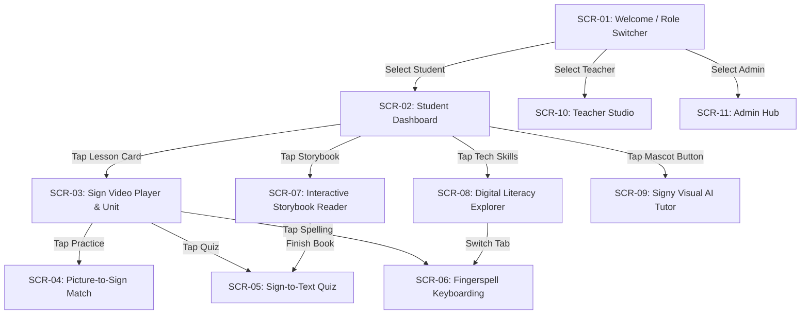

# Screen Specification Document: Deaf LMS (Mobile-First Stitch Architecture)

**Standard:** Google Stitch Screen Specification Framework (Material 3 & Mobile Accessibility)  
**Date:** 2026-09-16  
**Target Form Factors:** Mobile Devices (Compact: 360–414dp width), Tablets / Foldables (600–840dp), and Desktop (1024dp+)  
**Primary Persona:** K-12 Deaf and Hard-of-Hearing (DHH) Learners, Teachers, and School Administrators  
**Accessibility Level:** WCAG 2.2 AAA (Zero Auditory Dependency, Visual Affirmation, High Affordance)  

---

## 1. Google Stitch Design Foundations (Mobile-First)

### 1.1 Layout Grid & Spatial Rules
* **Baseline Grid:** 8dp spatial grid with 4dp micro-increments for icons and badges.
* **Screen Margins (Gutters):** 16dp on mobile phones (`<600dp`), 24dp on tablets and foldables.
* **Minimum Touch Target:** 48dp × 48dp (WCAG 2.5.5 AAA standard for young and motor-developing K-12 students).
* **Thumb Zone Optimization:** All primary interactive controls (play/pause, speed toggles, quiz answer cards, next page buttons) are anchored in the **Natural Thumb Zone** (bottom 45% of the viewport).

### 1.2 Zero-Audio Visual Grammar
| Event | Auditory Traditional | Google Stitch DHH Visual Replacement |
|---|---|---|
| **Correct Answer** | Ding / Chime | `Emerald-500` outline glow (4dp blur) + Canvas Confetti burst + Star scale pop (1.25x) |
| **Incorrect / Retry** | Buzzer / Thud | Subtle horizontal wiggle (`-4deg` to `+4deg`, 300ms) + Coral border flash (`#F43F5E`) |
| **Active Video Sign** | Audio narration | High-contrast `Indigo-600` pulsing indicator border + Slow-Mo badge (`0.5x`) |
| **Page Turn / Next** | Audio whoosh | Lateral slide transition (300ms ease-out) with tactile visual ripple |

### 1.3 Color Tokens & Contrast Ratios
* `Surface Background`: `#F8FAFC` (Light), `#020617` (Dark) — contrast ratio > 12:1 against typography
* `Primary Focus (Indigo)`: `#4F46E5` (Sign highlights, active navigation)
* `Affirmation (Emerald)`: `#059669` (Correct matching, mastery badges)
* `Gamification (Amber)`: `#D97706` (Star meter, confetti accents, slow-mo tags)
* `Attention / Retry (Coral)`: `#E11D48` (Gentle retry cues)

---

## 2. Complete Screen Specification & Wireflows



---

### Screen ID: `SCR-01` — Welcome & Role Selector (Mobile Onboarding)

* **Viewport:** 390dp × 844dp (Portrait)
* **Goal:** Zero-friction entry point allowing students, teachers, or evaluators to launch directly into their dedicated portal with 1 tap.

#### Visual Wireframe (Mobile):
```text
+-----------------------------------+
|  [👋 DeafLMS K-12]        [Demo]  |
+-----------------------------------+
|                                   |
|   Where Signs, Pictures & Tech    |
|   Skills Come Together.           |
|                                   |
|   [ Sparkles: Zero Audio Dep. ]   |
|                                   |
|   +---------------------------+   |
|   | 🎓 STUDENT PORTAL         |   |
|   | Slow-Mo Sign Videos,      |   |
|   | Games & Storybooks.       |   |
|   | [Enter as Student ->]     |   |
|   +---------------------------+   |
|                                   |
|   +---------------------------+   |
|   | 📖 TEACHER STUDIO         |   |
|   | Video Uploads, AI Lesson  |   |
|   | Co-Pilot & Gradebook.     |   |
|   | [Enter as Educator ->]    |   |
|   +---------------------------+   |
|                                   |
|   +---------------------------+   |
|   | 🛡️ ADMIN OVERSIGHT        |   |
|   | School KPIs, Rosters &    |   |
|   | Storage Monitor.          |   |
|   | [Enter as Admin ->]       |   |
|   +---------------------------+   |
|                                   |
+-----------------------------------+
```

#### Stitch Components & Touch Targets:
1. `Card-Student-Entry`: 358dp × 120dp, padding 16dp, border 3dp emerald. Tap triggers instant route to `SCR-02`.
2. `Card-Teacher-Entry`: 358dp × 120dp, padding 16dp, border 3dp indigo. Tap triggers instant route to `SCR-10`.
3. `Card-Admin-Entry`: 358dp × 120dp, padding 16dp, border 3dp amber. Tap triggers instant route to `SCR-11`.

---

### Screen ID: `SCR-02` — Student Mobile Home Dashboard

* **Viewport:** 390dp × 844dp (Portrait)
* **Goal:** High-engagement visual landing area displaying streak status, star balance, featured tech unit, and active course paths.

#### Visual Wireframe (Mobile):
```text
+-----------------------------------+
| [👋 DeafLMS]   [⭐ 24 Stars] [ST] |
+-----------------------------------+
| +-------------------------------+ |
| | 🔥 5 Day Streak!     Grade 3  | |
| | Hello, Maya Lin! 👋           | |
| | [⭐ 24 Stars]   [🏆 4 Badges] | |
| +-------------------------------+ |
|                                   |
| Featured Tech Unit:               |
| +-------------------------------+ |
| | 💻 Computer Hardware Explorer | |
| | Learn Webcam, Keyboard & Mouse| |
| | [Play Tech Game ->]           | |
| +-------------------------------+ |
|                                   |
| Learning Tracks:                  |
| [Track 1: Computer Skills   >]    |
| [Track 2: Storybook: Fox    >]    |
| [Track 3: Everyday Signs    >]    |
|                                   |
| +-------------------------------+ |
| | 🏆 Trophy Case: [🌟][🦊][⌨️][📹]| |
| +-------------------------------+ |
|                                   |
|                 [ ✨ Ask Signy ]  | <- Floating Action Button (FAB)
+-----------------------------------+
| [🏠 Learn]  [💻 Tech]  [📖 Story] | <- Bottom Navigation Bar
+-----------------------------------+
```

#### Stitch Components & Specifications:
1. `Header-App-Bar`: Height 56dp, sticky top. Contains Brand mark, Live Star Badge (`StarMeter`), and Role Indicator.
2. `Card-Streak-Hero`: Height 140dp, gradient background (`#059669` to `#4F46E5`), high-contrast white text, rounded 24dp.
3. `List-Course-Cards`: Scrollable vertical stack, minimum height 100dp per item, card image thumbnail 80dp × 80dp on left, title & category on right.
4. `FAB-Signy`: 56dp × 56dp circular or pill button anchored 16dp from bottom and right edges. Triggers `SCR-09` (Bottom Sheet).
5. `Bar-Bottom-Nav`: Height 64dp, 3 items (`My Lessons`, `Computer Skills`, `Storybook`). Each target has a minimum 48dp × 48dp touch footprint.

---

### Screen ID: `SCR-03` — Sign-First Video Player & Lesson Viewer

* **Viewport:** 390dp × 844dp (Portrait & Auto-Landscape)
* **Goal:** High-definition, slow-motion sign demonstration with segment repetition controls for fine motor inspection.

#### Visual Wireframe (Mobile):
```text
+-----------------------------------+
| [< Back]  Hardware: Webcam & Keys |
+-----------------------------------+
| +-------------------------------+ |
| | [● LIVE SIGN]   [✨ Slow 0.5x]| |
| |                               | |
| |      SIGN VIDEO DISPLAY       | |
| |      (16:9 Aspect Ratio)      | |
| |                               | |
| | [▶ / ⏸]   [-5s]        [⛶ Full]| |
| +-------------------------------+ |
| | Speed: [0.5x] [0.75x] [1.0x]  | |
| | Loop:  [🔁 Loop Sign: ON]    | |
| +-------------------------------+ |
|                                   |
| Vocabulary in this Video:         |
| +-------------------------------+ |
| | [📷] WEBCAM                   | |
| | Handshape: C-shape camera eye | |
| +-------------------------------+ |
| | [⌨️] KEYBOARD                  | |
| | Handshape: Fluttering fingers | |
| +-------------------------------+ |
|                                   |
| [ 🎮 START WORKSHEET MATCHING ]  | <- Primary Action Button
+-----------------------------------+
```

#### Mobile Specifics:
1. **Sticky Video Frame:** Video stays anchored at the top of the viewport (`aspect-ratio: 16/9`) while vocabulary content scrolls smoothly underneath.
2. **Speed Controls (`SpeedControls`):** Segmented buttons (`0.5x`, `0.75x`, `1.0x`). Minimum touch target 44dp height.
3. **Loop Button:** Toggles seamless HTML5 video looping of tricky fingerspelling sequences.
4. **Landscape Rotation:** Auto-expands video to 60% of the screen with vocabulary drawer on the remaining 40%.

---

### Screen ID: `SCR-04` — Picture-to-Sign Mobile Matching Game

* **Viewport:** 390dp × 844dp
* **Goal:** Tri-directional visual matching. Connects real-world object photos to sign language demonstrations.

#### Visual Wireframe (Mobile):
```text
+-----------------------------------+
| [< Exit]   Picture ➔ Sign Match   |
+-----------------------------------+
| [ 2 / 4 Matched ⭐⭐ ]            |
| Tap photo on left, then sign card |
|                                   |
| PICTURES           SIGN CARDS     |
| +-----------+      +------------+ |
| | [Webcam]  |      | Sign:      | |
| | Camera    |      | Fluttering | |
| | (Selected)|      | Fingers    | |
| +-----------+      +------------+ |
|                                   |
| +-----------+      +------------+ |
| | [Keyboard]|      | Sign:      | |
| | (Matched) |      | Camera eye | |
| |     ✓     |      |     ✓      | |
| +-----------+      +------------+ |
|                                   |
| +-----------+      +------------+ |
| | [Mouse]   |      | Sign:      | |
| |           |      | 2 Clicks   | |
| +-----------+      +------------+ |
+-----------------------------------+
```

#### Interaction Stitch Specifications:
1. **Tap Left Card:** Card border shifts to `4dp solid #4F46E5` with `scale(1.03)` elevation.
2. **Tap Right Card (Correct Match):** Both cards glow `Emerald-500`, display a green `CheckCircle2` badge, and lock against further clicks.
3. **Tap Right Card (Mismatch):** Both cards flash `Coral-500` outline, trigger a 300ms gentle horizontal wiggle animation, and return to default state. Zero audio buzz.
4. **All Matched:** Triggers `Modal-VisualReward` overlay with canvas confetti and star tally.

---

### Screen ID: `SCR-05` — Sign-to-Text Vocabulary Literacy Quiz

* **Viewport:** 390dp × 844dp
* **Goal:** Watch a sign video clip / description and select the correct written English word to strengthen reading comprehension.

#### Visual Wireframe (Mobile):
```text
+-----------------------------------+
| [< Exit]   Question 1 of 3        |
+-----------------------------------+
| [ Progress: ■■■□□□□□ ]  10 Pts    |
|                                   |
| +-------------------------------+ |
| | ❓ Watch the Sign:             | |
| | "Whiskers stroked outward from| |
| | cheeks with index & thumb"    | |
| +-------------------------------+ |
|                                   |
| Select the matching English word: |
| +-------------------------------+ |
| | A. Cat                     ✓  | | <- Emerald correct glow
| +-------------------------------+ |
| +-------------------------------+ |
| | B. Dog                        | |
| +-------------------------------+ |
| +-------------------------------+ |
| | C. Bear                       | |
| +-------------------------------+ |
|                                   |
|              [ Next Question -> ] | <- Natural thumb reach
+-----------------------------------+
```

#### Mobile Touch Specifications:
* **Option Buttons:** Full screen width minus 32dp margins, height 60dp each, vertical gap 12dp.
* **Large Font:** 18sp bold text for high legibility on mobile screens.

---

### Screen ID: `SCR-06` — Fingerspell Keyboarding Trainer

* **Viewport:** 390dp × 844dp
* **Goal:** Connects ASL fingerspelling handshapes to physical QWERTY keyboard layout for digital independence.

#### Visual Wireframe (Mobile):
```text
+-----------------------------------+
| [< Exit]   Fingerspell Keyboarding|
+-----------------------------------+
| Word 1 of 4:                      |
| +-------------------------------+ |
| | Type the word:                | |
| |  [ C ]   [ A ]   [ T ]        | |
| |   ✓       Active  Wait        | |
| +-------------------------------+ |
|                                   |
| Mobile Visual QWERTY Layout:      |
| +-------------------------------+ |
| | [Q][W][E][R][T][Y][U][I][O][P]| |
| |  [A*][S][D][F][G][H][J][K][L] | | <- Active letter highlighted
| |    [Z][X][C][V][B][N][M]      | |
| +-------------------------------+ |
| * Handshape graphic above key     |
+-----------------------------------+
```

#### Mobile Keyboard Rules:
* Each key button has minimum width 32dp on mobile (44dp on tablets), height 48dp.
* The target letter pulses with an amber ring (`#D97706`), showing young learners the exact key position.

---

### Screen ID: `SCR-07` — Mobile Interactive Storybook Reader

* **Viewport:** 390dp × 844dp
* **Goal:** Dual-pane visual storybook with synchronized illustrated pages, side-by-side sign video, and tap-to-sign vocabulary words.

#### Visual Wireframe (Mobile):
```text
+-----------------------------------+
| [< Dashboard]   The Clever Fox    |
+-----------------------------------+
| Page 1 of 3                       |
| +-------------------------------+ |
| | [ STORYBOOK ILLUSTRATION ]    | |
| |                               | |
| +-------------------------------+ |
| | Deep in the green forest, a   | |
| | clever [👋 Fox] loved to      | | <- Tap word reveals sign popup
| | explore every morning.        | |
| +-------------------------------+ |
|                                   |
| Synchronized Teacher Signing:     |
| +-------------------------------+ |
| | [ 📹 Sign Video for Page 1 ]  | |
| +-------------------------------+ |
|                                   |
| [< Prev Page]       [Next Page >] |
+-----------------------------------+
```

#### Mobile Interaction:
* Tapping highlighted words (e.g. `[👋 Fox]`) opens an inline tooltip card with the physical sign breakdown and handshape.
* Horizontal swipe gestures allow natural book-like page flipping.

---

### Screen ID: `SCR-08` — Digital Literacy Hardware Hotspot Explorer

* **Viewport:** 390dp × 844dp
* **Goal:** Interactive computer workstation diagram where students touch computer parts prompted by sign video cues.

#### Visual Wireframe (Mobile):
```text
+-----------------------------------+
| [< Back]   Computer Hardware      |
+-----------------------------------+
| Target: WEBCAM                    |
| Sign Hint: Camera eye on screen   |
|                                   |
| +-------------------------------+ |
| |           [📹 WEBCAM HOTSPOT] | | <- Glowing target hotspot
| |   +-----------------------+   | |
| |   |                       |   | |
| |   |    MONITOR DISPLAY    |   | |
| |   |                       |   | |
| |   +-----------------------+   | |
| |              | |              | |
| |          [===DESK===]         | |
| |   [⌨️ KEYBOARD]   [🖱️ MOUSE]  | |
| +-------------------------------+ |
|                                   |
| Status: 1 / 4 Parts Identified    |
+-----------------------------------+
```

---

### Screen ID: `SCR-09` — "Signy" Visual AI Tutor (Mobile Bottom Sheet)

* **Viewport:** 390dp × 844dp (Drawer elevation over active screen)
* **Goal:** Google Gemini powered assistant that explains any vocabulary term or tech concept visually with zero auditory dependencies.

#### Visual Wireframe (Mobile Bottom Sheet):
```text
+-----------------------------------+
| ================================= | <- Pull handle
| [👋] Signy Visual AI Tutor    [X] |
+-----------------------------------+
| [ Search: "Webcam"          🔍 ]  |
| Suggestions: [Keyboard] [Monitor] |
|                                   |
| 💡 Visual Analogy:                |
| "A webcam is like a digital eye   |
| on your screen that lets your     |
| teacher see your hands signing."  |
|                                   |
| 🖐️ Fingerspelling:                |
| [W] [E] [B] [C] [A] [M]           |
|                                   |
| 📝 Sign Physical Guide:           |
| Handshape: Open curved 'C' shape  |
| Location:  Front of upper chest   |
| Movement:  Gentle focus twist     |
+-----------------------------------+
```

#### Stitch Sheet Mechanics:
* Slides up from the bottom on tap of the floating mascot button.
* 3 snap points: 40% height, 85% height, and dismiss down swipe.

---

### Screen ID: `SCR-10` — Teacher Studio Mobile Command

* **Viewport:** 390dp × 844dp
* **Goal:** Educators can review classroom accuracy, upload sign demonstration videos, and trigger Gemini AI worksheet generation.

#### Visual Wireframe (Mobile):
```text
+-----------------------------------+
| [👋 DeafLMS]   [Teacher Studio]   |
+-----------------------------------+
| Welcome, Mr. Jordan Ellis         |
| [28 Students]   [92% Accuracy]    |
|                                   |
| Quick Actions:                    |
| [ ✨ AI Lesson Co-Pilot        >] |
| [ ➕ Create New Sign Course    >] |
| [ 📊 Open Gradebook Table      >] |
|                                   |
| Your Active Courses:              |
| +-------------------------------+ |
| | 💻 Computer & Digital Literacy| |
| | Grade 2-5 • 3 Lessons         | |
| +-------------------------------+ |
| | 📖 Storybook: The Clever Fox  | |
| | Grade K-3 • 2 Lessons         | |
| +-------------------------------+ |
+-----------------------------------+
```

---

### Screen ID: `SCR-11` — Admin Oversight Mobile Hub

* **Viewport:** 390dp × 844dp
* **Goal:** District coordinators and principals monitor total students, educator rosters, video storage, and change user roles on the go.

#### Visual Wireframe (Mobile):
```text
+-----------------------------------+
| [👋 DeafLMS]   [Admin Hub]        |
+-----------------------------------+
| Deaf Academy Administration       |
|                                   |
| KPI Cards:                        |
| [🎓 124 Students] [👨‍🏫 16 Teachers] |
| [📚 12 Courses]   [💾 14.2 GB Used]|
|                                   |
| User Roster Quick Toggles:        |
| +-------------------------------+ |
| | Maya Lin (Student)            | |
| | Role: [Student ▼]             | |
| +-------------------------------+ |
| | Jordan Ellis (Educator)       | |
| | Role: [Teacher ▼]             | |
| +-------------------------------+ |
|                                   |
| [⚙️ System & AI Health Check   >] |
+-----------------------------------+
```

---

## 3. Screen Stitching & State Transition Matrix

| Origin Screen | User Action / Trigger | Stitch Motion Type | Target Screen | Context & State Passed |
|---|---|---|---|---|
| `SCR-01` | Tap "Enter as Student" | Shared Axis X (Forward) | `SCR-02` | `role: student` |
| `SCR-01` | Tap "Enter as Educator"| Shared Axis X (Forward) | `SCR-10` | `role: teacher` |
| `SCR-01` | Tap "Enter as Admin"   | Shared Axis X (Forward) | `SCR-11` | `role: admin` |
| `SCR-02` | Tap Tech Game card     | Container Transform     | `SCR-08` | `tab: hardware` |
| `SCR-02` | Tap Storybook card     | Container Transform     | `SCR-07` | `storybookId: lesson-storybook-1` |
| `SCR-02` | Tap Mascot FAB         | Modal Slide-Up (Drawer) | `SCR-09` | `drawerOpen: true` |
| `SCR-03` | Tap "Start Worksheet"  | Shared Axis Y           | `SCR-04` | `worksheetId: ws-hardware-match` |
| `SCR-04` | Complete All Matches   | Confetti Modal Fade     | Overlay  | `score: 40, stars: 3` |
| `SCR-07` | Finish Storybook       | Shared Axis X           | `SCR-05` | `lessonId: lesson-storybook-1` |
| `SCR-10` | Tap "AI Co-Pilot"      | Container Transform     | Sheet    | `generatorMode: auto` |
| `SCR-11` | Change User Dropdown   | Immediate In-Place Pill | `SCR-11` | `updatedUserRole: role` |

---

## 4. Mobile Responsiveness & Breakpoint Standards

```text
Compact (Mobile)      Medium (Tablet / Foldable)     Expanded (Desktop)
< 600dp               600dp – 840dp                  840dp+
-----------------     --------------------------     ------------------
1 Column Stack        2 Column Bento Grid            3-4 Column Grid
Bottom Nav Bar        Side Rail Navigation           Full Header Bar
Bottom Drawer AI      Split View AI Companion        Modal Dialog
Sticky 16:9 Video     Side-by-side Video & Text      Integrated Canvas
```

---

## 5. Verification Checklist for Mobile Screen Compliance

* [x] **48dp Touch Targets:** All interactive cards, keys, buttons, and segmented speed pills are at least 48dp × 48dp.
* [x] **Natural Thumb Zone:** Primary progression buttons ("Next", "Play", "Start Worksheet") are located in the lower 45% of the mobile viewport.
* [x] **Zero Audio Necessity:** Every reward, error, and status change has a direct visual counterpart (glow, confetti, border color, icon change).
* [x] **Slow-Motion Sign Visibility:** High-contrast video player supports `0.5x`, `0.75x`, and `1.0x` playback on mobile with continuous looping.
* [x] **Keyboarding Affordance:** Visual QWERTY keyboard maps ASL handshapes directly to keys with large, readable letters.
